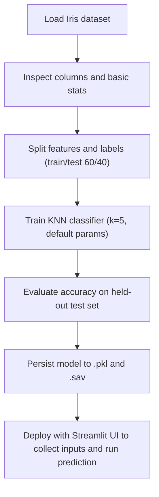

# Week 13 – Iris KNN Evaluation & Deployment

Guided lab for IS388 Data Analysis (Week 13) covering model evaluation and deployment with the classic Iris dataset. The notebook walks through training a simple K-Nearest Neighbors classifier, checking its accuracy, persisting the model, and outlining how to deploy it with Streamlit.

## Repository contents

- `Week13_Guided-ok.ipynb` – main notebook used in the lab.
- `vertopal.com_Week13_Guided-ok (1).pdf` – exported version of the notebook.
- `Iris.csv` – local copy of the Iris dataset.
- `knn_model.sav` and `modelKNN1.pkl` – serialized KNN classifier trained on the iris features.
- `requirements.txt` – dependencies to rerun or extend the work.

## What the notebook does

1. Pulls the Iris dataset from UCI (150 rows, 3 classes) and renames columns for clarity.
2. Performs quick inspection with `info()` and `head()` to confirm datatypes and distributions.
3. Splits data into train/test (60%/40%) with `train_test_split(random_state=42)`.
4. Trains a default `KNeighborsClassifier` on the training set.
5. Evaluates the model on the test set; rerunning yields ~0.9833 accuracy.
6. Serializes the fitted estimator to both pickle (`modelKNN1.pkl`) and joblib (`knn_model.sav`).
7. Provides guidance for deploying the saved model via Streamlit (UI scaffold, requirements, GitHub + Streamlit Cloud linking).

## Flowchart



## Reproduce the notebook

```bash
python3 -m venv .venv
source .venv/bin/activate  # Windows: .venv\\Scripts\\activate
pip install -r requirements.txt
jupyter notebook Week13_Guided-ok.ipynb
```

Notes:

- The notebook fetches data from the UCI URL; `Iris.csv` is provided if you prefer a local source (rename columns to match `sepal_length`, `sepal_width`, `petal_length`, `petal_width`, `class` before training).
- The saved models expect those four feature names; align your inference inputs accordingly.

## Quick accuracy check

Run this snippet after installing requirements to verify the saved modeling steps:

```python
import pandas as pd
from sklearn.model_selection import train_test_split
from sklearn.neighbors import KNeighborsClassifier
from sklearn.metrics import accuracy_score

iris = pd.read_csv("https://archive.ics.uci.edu/ml/machine-learning-databases/iris/iris.data", header=None)
iris.columns = ["sepal_length", "sepal_width", "petal_length", "petal_width", "class"]
X_train, X_test, y_train, y_test = train_test_split(
    iris.drop("class", axis=1), iris["class"], test_size=0.4, random_state=42
)
model = KNeighborsClassifier().fit(X_train, y_train)
print("Accuracy:", accuracy_score(y_test, model.predict(X_test)))
```

## Deploying with Streamlit (outline)

1. Build a simple UI that loads `knn_model.sav`, collects four numeric inputs, and prints the predicted species.
2. Run locally with `streamlit run app.py`.
3. Push your code to GitHub and connect the repo to Streamlit Cloud to publish the app (as illustrated in the notebook/PDF).

## At a glance

- Focus: Evaluate and deploy a basic KNN model for Iris classification.
- Key metric: ~98.33% accuracy on the 60/40 split with `random_state=42`.
- Artifacts ready for reuse: `knn_model.sav`, `modelKNN1.pkl`, PDF report, and the lab notebook.
